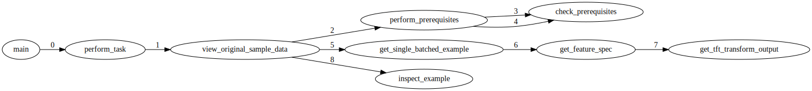
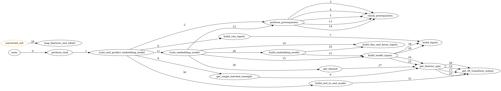

# tft_tasks

A task based approach to using tensorflow transform. 

Usage instructions:

```
usage: tft_tasks.py [-h] --task TASKS [--visualize_tasks VISUALIZATION_FILENAME]
                    [--print_performance_metrics]

A task based approach to using tensorflow transform.

optional arguments:
  -h, --help            show this help message and exit
  --task TASKS          Pick tasks from {'train_embedding_model',
                        'train_and_predict_embedding_model', 'write_raw_tfrecords',
                        'clean_directory', 'view_transformed_sample_data',
                        'train_non_embedding_model', 'view_original_sample_data',
                        'transform_tfrecords'}
  --visualize_tasks VISUALIZATION_FILENAME
                        Specify the filename to visualize the execution of tft
                        tasks(e.g. mlops_pipeline.svg)
  --print_performance_metrics
                        specify if you want performance metrics to be printed to the
                        console
```

To execute the full lifecycle and visualize it, enter the below:
If you have all of the prequisites in requirements.txt, you should see something like this. 
<p align="center">

</p>

```
python tft_tasks.py --task train_non_embedding_model --visualize_tasks mlops_pipeline_non_embedding_model.svg
```

# Goals of project

Machine learning frameworks such as scikit-learn are amazing, and they are so elegant.  But there's a reason frameworks such as tensorflow exist; the complexity they represent is the price to pay to solve deeper problems at scale.  The jump from scikit-learn to tensorflow is conceptually difficult.  My goal for this project is to make that jump a little bit easier by doing the following things:

1. Provide a working example that shows the power of tensorflow and tensorflow transform, including the data, pipelines, and some visualization so that it's easier to see what is going on.
2. Construct the working example in such a way that it can be easily re-used, and the various parts can be easily swapped out, specifically the data, the model architecture, even the flow of the pipeline itself.  The last part of this is the reason for the name of the project: tft_tasks breaks down the ML pipeline into tasks in such a way that you don't need to understand all of the pieces in order to benefit from it.  You can abstract out the parts you don't yet understand, or the parts that other teams work on.  For example, the task view original_sample_data and view_transformed_sample_data allows you to inspect interactively the result of the transformations applied by the preprocessing_fn.
3. Decompose the ML pipeline, and visualize it, to make understanding the whole more tractable.  The visualization feature currently shows the order of execution for the pipeline, which makes it very clear that the framework can be understood by biting off small pieces.  
   
These goals will evolve, as my learning evolves.  My personal (selfish) goal is to learn from the great engineers that contribute to open source every day, and to become a better thinker via programming.   

# Sample Graphs

## All tasks
<p align="center">

</p>

## View original sample data task
<p align="center">

</p>

## View transformed sample data task
<p align="center">

</p>

## Train and predict embedding model task
<p align="center">

</p>

# Sample Performance Metrics Output

## Train and predict non-embedding model

The below table is sorted in ascending order by start_time, an unshown field.

╒════╤═══════════════════════════════════╤═══════════════════════════════════╤════════════════╕
│    │ caller                            │ called                            │   elapsed_time │
╞════╪═══════════════════════════════════╪═══════════════════════════════════╪════════════════╡
│  0 │ main                              │ perform_task                      │      16.370039 │
├────┼───────────────────────────────────┼───────────────────────────────────┼────────────────┤
│  1 │ perform_task                      │ train_and_predict_embedding_model │      16.369750 │
├────┼───────────────────────────────────┼───────────────────────────────────┼────────────────┤
│  2 │ train_and_predict_embedding_model │ check_prerequisites               │       0.000002 │
├────┼───────────────────────────────────┼───────────────────────────────────┼────────────────┤
│  3 │ train_and_predict_embedding_model │ perform_task                      │       2.510809 │
├────┼───────────────────────────────────┼───────────────────────────────────┼────────────────┤
│  4 │ perform_task                      │ write_raw_tfrecords               │       2.510439 │
├────┼───────────────────────────────────┼───────────────────────────────────┼────────────────┤
│  5 │ write_raw_tfrecords               │ pipeline_function                 │       2.510024 │
├────┼───────────────────────────────────┼───────────────────────────────────┼────────────────┤
│  6 │ train_and_predict_embedding_model │ perform_task                      │       3.253606 │
├────┼───────────────────────────────────┼───────────────────────────────────┼────────────────┤
│  7 │ perform_task                      │ transform_tfrecords               │       3.253235 │
├────┼───────────────────────────────────┼───────────────────────────────────┼────────────────┤
│  8 │ transform_tfrecords               │ pipeline_function                 │       3.252778 │
├────┼───────────────────────────────────┼───────────────────────────────────┼────────────────┤
│  9 │ train_and_predict_embedding_model │ check_prerequisites               │       0.000001 │
├────┼───────────────────────────────────┼───────────────────────────────────┼────────────────┤
│ 10 │ train_and_predict_embedding_model │ build_raw_inputs                  │       0.005587 │
├────┼───────────────────────────────────┼───────────────────────────────────┼────────────────┤
│ 11 │ train_and_predict_embedding_model │ get_single_batched_example        │       0.011192 │
├────┼───────────────────────────────────┼───────────────────────────────────┼────────────────┤
│ 12 │ get_single_batched_example        │ get_tft_transform_output          │       0.000010 │
├────┼───────────────────────────────────┼───────────────────────────────────┼────────────────┤
│ 13 │ train_and_predict_embedding_model │ get_tft_transform_output          │       0.000006 │
├────┼───────────────────────────────────┼───────────────────────────────────┼────────────────┤
│ 14 │ train_and_predict_embedding_model │ build_transformed_inputs          │       0.010487 │
├────┼───────────────────────────────────┼───────────────────────────────────┼────────────────┤
│ 15 │ train_and_predict_embedding_model │ build_embedding_model             │       0.328490 │
├────┼───────────────────────────────────┼───────────────────────────────────┼────────────────┤
│ 16 │ build_embedding_model             │ build_dnn_and_keras_inputs        │       0.000004 │
├────┼───────────────────────────────────┼───────────────────────────────────┼────────────────┤
│ 17 │ train_and_predict_embedding_model │ get_transformed_dataset           │       0.169899 │
├────┼───────────────────────────────────┼───────────────────────────────────┼────────────────┤
│ 18 │ get_transformed_dataset           │ get_tft_transform_output          │       0.000008 │
├────┼───────────────────────────────────┼───────────────────────────────────┼────────────────┤
│ 19 │ converted_call                    │ map_features_and_labels           │       0.015560 │
├────┼───────────────────────────────────┼───────────────────────────────────┼────────────────┤
│ 20 │ train_and_predict_embedding_model │ build_end_to_end_model            │       0.891528 │
├────┼───────────────────────────────────┼───────────────────────────────────┼────────────────┤
│ 21 │ build_end_to_end_model            │ get_tft_transform_output          │       0.000009 │
├────┼───────────────────────────────────┼───────────────────────────────────┼────────────────┤
│ 22 │ main                              │ closeout_task                     │       0.000121 │
╘════╧═══════════════════════════════════╧═══════════════════════════════════╧════════════════╛

