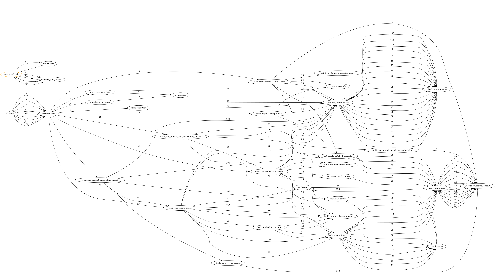

# tft_tasks

A task based approach to using tensorflow transform. 

Usage instructions:

```
python tft_tasks_cli.py -h
usage: tft_tasks_cli.py [-h] --task TASKS [--visualize_tasks VISUALIZATION_FILENAME] [--print_performance_metrics]

A task based approach to using tensorflow transform.

optional arguments:
  -h, --help            show this help message and exit
  --task TASKS          Pick tasks from {'view_transformed_sample_data', 'clean_directory', 'train_non_embedding_model', 'train_and_predict_non_embedding_model',
                        'preprocess_raw_data', 'train_embedding_model', 'train_and_predict_embedding_model', 'transform_raw_data', 'view_original_sample_data'}
  --visualize_tasks VISUALIZATION_FILENAME
                        Specify the filename to visualize the execution of tft tasks(e.g. mlops_pipeline.svg)
  --print_performance_metrics
                        specify if you want performance metrics to be printed to the console
```

To execute the full lifecycle and visualize it, enter the below:
If you have all of the prequisites in requirements.txt, you should see something like this. 
<p align="center">

</p>

```
python tft_tasks_cli.py --task train_non_embedding_model --visualize_tasks mlops_pipeline_non_embedding_model.svg
```

# Goals of project

Machine learning frameworks such as scikit-learn are amazing, and they are so elegant.  But there's a reason frameworks such as tensorflow exist; the complexity they represent is the price to pay to solve deeper problems at scale.  The jump from scikit-learn to tensorflow is conceptually difficult.  My goal for this project is to make that jump a little bit easier by doing the following things:

1. Provide a working example that shows the power of tensorflow and tensorflow transform, including the data, pipelines, and some visualization so that it's easier to see what is going on.
2. Construct the working example in such a way that it can be easily re-used, and the various parts can be easily swapped out, specifically the data, the model architecture, even the flow of the pipeline itself.  The last part of this is the reason for the name of the project: tft_tasks breaks down the ML pipeline into tasks in such a way that you don't need to understand all of the pieces in order to benefit from it.  You can abstract out the parts you don't yet understand, or the parts that other teams work on.  For example, the task view original_sample_data and view_transformed_sample_data allows you to inspect interactively the result of the transformations applied by the preprocessing_fn.
3. Decompose the ML pipeline, and visualize it, to make understanding the whole more tractable.  The visualization feature currently shows the order of execution for the pipeline, which makes it very clear that the framework can be understood by biting off small pieces.  
   
These goals will evolve, as my learning evolves.  My personal (selfish) goal is to learn from the great engineers that contribute to open source every day, and to become a better thinker via programming.   

# Sample Graphs

## All tasks
<p align="center">

</p>

## View original sample data task
<p align="center">

</p>

## View transformed sample data task
<p align="center">

</p>

## Train and predict embedding model task
<p align="center">

</p>

# Sample Performance Metrics Output

## Train and predict non-embedding model

The below table is sorted in ascending order by start_time, an unshown field.

|    | caller                    | called                     |   elapsed_time |
|----|---------------------------|----------------------------|----------------|
|  0 | main                      | perform_task               |       5.671713 |
|  1 | perform_task              | train_non_embedding_model  |       5.671396 |
|  2 | train_non_embedding_model | check_prerequisites        |       0.000002 |
|  3 | train_non_embedding_model | perform_task               |       4.499159 |
|  4 | perform_task              | transform_tfrecords        |       4.498804 |
|  5 | transform_tfrecords       | pipeline_function          |       4.498391 |
|  6 | train_non_embedding_model | check_prerequisites        |       0.000001 |
|  7 | train_non_embedding_model | get_tft_transform_output   |       0.000010 |
|  8 | train_non_embedding_model | build_transformed_inputs   |       0.013609 |
|  9 | train_non_embedding_model | build_dnn_and_keras_inputs |       0.000005 |
| 10 | train_non_embedding_model | build_non_embedding_model  |       0.027629 |
| 11 | train_non_embedding_model | get_transformed_dataset    |       0.171039 |
| 12 | get_transformed_dataset   | get_tft_transform_output   |       0.000007 |
| 13 | converted_call            | map_features_and_labels    |       0.015388 |
| 14 | main                      | closeout_task              |       0.000120 |


# High-level Design

## Relationship between tft_tasks_cli and tft_tasks

The entry-point into tft_tasks is ```tft_tasks_cli.py```.  The relationship
between ```tft_tasks_cli.py``` and ```tft_tasks.py``` can be visualized
as follows:


```tft_tasks_cli``` does the following things:

- Imports ```argparse```
- Imports the ```main``` function from ```tft_tasks``` as ```tft_tasks_main```
- Imports available tasks from ```tft_tasks``` via ```Task```


```tft_tasks_cli``` module, through ```main```:
  

- Defines a ```get_args``` function, which uses ```argparse``` to:
    - define the structure of arguments, along with help information
    - retrieve them from the command line by invoking ```get_args```, which, 
in turn, takes the list provided by ```sys.argv``` and turns it into a 
```Namespace``` object using ```parser.parse_args``` and stores
into ```args```.  The Namespace object can be thought of as an object that has attributes that contain a list of the arguments that are passed.  For example, args.tasks contains a list ['clean_directory'].  You can create a name Namespace and argument as follows

```
import argparse
b = argparse.Namespace()
b.cat = ['dog']
```

This is how you can interactively run the program.  

```
import argparse
from tft_tasks import main as tft_tasks_main
from tft_tasks import Task
args = argparse.Namespace()
args.tasks = ['clean_directory']
#Set the other two parameters too
tft_tasks_main(args)
```

Similarly, you can run it by sourcing all of tft_tasks.py and then doing

```
import argparse
args = argparse.Namespace()
args.tasks = ['train_and_predict_embedding_model']
main(args)
```

- Invokes ```tft_tasks_main(args)```

For the simplest task ```clean_directory```, this sequence can be 
visualized as follows


The tasks themselves are performed by ```tft_tasks```, whose design we look at
here.

## Design of ```tft_tasks```

Tasks are stored in a task dictionary, and are designed and implemented such
that they can be executed as functions without any arguments. For example,
generically, a task is executed as follows: 

```self.task_dictionary[task_name]()```

So the object that resides at ```self.task_dictionary[task_name]``` must be
completely self sufficient.  In order to compose that object, we use, generally,
a partial function comprised of a function from the class ```Task```, 
instance name ```my_tasks``` and a dataclass from class ```MLMetaData``` 
instance name ```my_taxicab_data```. The function implements whatever 
transformation is required, and the ```MLMetaData``` instance provides access
to the data to be transformed.  


After the class ```MLMetaData``` has been initialized, its ```RAW_DATA_DICTIONARY```
is populated using the ```CSV_COLUMNS``` and their ```ALL_DTYPES```, and
similarly with ```RAW_DATA_FEATURE_SPEC``` using ```RAW_DATA_DICTIONARY```.
Lastly, the ```_SCHEMA``` is created using ```schema_utils.schema_from_feature_spec```
using ```RAW_DATA_FEATURE_SPEC```

The ```MLMetaData``` class has no methods.


    
In main, ```MLMetaData``` is first initialized, and then ```Task``` right after.
After some cleanup, ```preprocessing_fn``` is defined, this function is not
monitored by the framework.  I ran into some challenges with apache beam that
prevented me from doing so.

After this, the ```task_dictionary``` is populated using partial functions, which
use functions from ```Task``` and pre-populates parameters and stores them
in the task_dictionary.  

After the ```task_dictionary``` is populated, the ```task_dag``` is populated with the
list of prerequisites. The task state dictionary is then read off of the disk
and the tasks are performed.  Lastly the visualization graph is produced along
with a report that shows how long each step took. The task state data is then
persisted to the disk.

## Example task at design time and runtime

The simplest task is clean directory.  Let's look at how it is set up and
executed.

### Design Time

- An element ```clean_directory``` is added to the ```Task.valid_tasks``` 
  frozenset.
- In this case, the task doesn't have any pre-requisites, but if it did, they
  would have been put in a list at ```my_tasks.task_dag['clean_directory']``` 
- A function decorated by ```@MyTracePath.inspect_function_execution``` is
  created as ```Task.clean_directory```. This function includes a call to
  ```perform_prerequisites``` which ensures the prerequisite activities are
  completed. It then executes the steps that are specific to itself.
- The function is added to ```my_tasks.task_dictionary['clean_directory']```  

### Runtime

When the user requests the execution of ```clean_directory```, 
the following things happen:

- The task is checked for validity by checking against the frozenset
- If it is valid, ```my_tasks.perform_task(task)``` is called, where task is
  set to ```clean_directory``` 
- ```Task.perform_task``` executes ```task_dictionary[task_name]()``` which
  handles all the pre-requisites, then executes code specific to itself.
- ```Task.task_completed[task]``` is set to True

